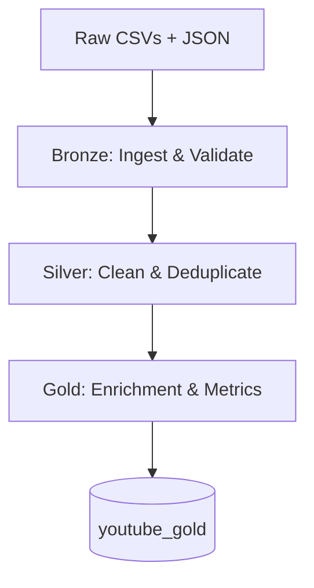

# YouTube Trending Videos | ETL Pipeline

An end-to-end PySpark ETL pipeline built in Databricks that ingests, validates, and transforms a multi-region YouTube trending dataset into an analytics-ready Gold table enriched with engagement metrics.

**Dataset:** [YouTube Trending Videos](https://www.kaggle.com/datasets/datasnaek/youtube-new) (Kaggle) — 10 regions, 539 MB raw CSV + JSON

---

## Architecture

A Medallion-style pipeline progressing through three layers:



---

## Pipeline

The pipeline is implemented as a set of modular, reusable functions across four notebooks:

| Notebook | Purpose |
|---|---|
| `youtube_etl_functions` | All reusable ETL functions |
| `youtube_etl_pipeline` | Orchestration — runs the full pipeline |
| `youtube_exploration` | Initial data discovery and prototyping |
| `youtube_analysis` | Downstream analysis and visualizations |

### Bronze — Ingestion & Validation
- `load_raw_csv()` — loads a single regional CSV with region lineage
- `load_all_regions()` — unions all regional CSVs into a single DataFrame
- `load_raw_json()` / `load_all_category_jsons()` — loads category metadata
- `validate_bronze()` — checks required columns, corrupt records, region completeness

### Silver — Cleaning & Standardization
- `transform_silver()` — casts types, filters corrupt video IDs, maps region codes to country names
- `deduplicate_trending()` — removes duplicate trending snapshots, keeping the last per video per region
- `validate_silver()` — checks deduplication, negative values, publish/trending date consistency, country mapping

### Gold — Enrichment & Feature Engineering
- `flatten_categories()` / `build_category_dim()` — flattens nested JSON, builds category dimension
- `add_business_metrics()` — computes engagement metrics (see below), respects `comments_disabled` and `ratings_disabled` flags
- `safe_div()` — division helper, avoids divide-by-zero
- `finalize_gold_schema()` — selects and orders final columns
- `validate_gold()` — checks row counts, schema, metric bounds, null alignment

---

## Metrics

| Feature | Formula | Notes |
|---|---|---|
| `engagement_rate` | `(likes + dislikes + comments) / views` | Excludes comments when `comments_disabled = true` |
| `like_ratio` | `likes / views` | Null when `ratings_disabled = true` |
| `comment_rate` | `comment_count / views` | Null when `comments_disabled = true` |
| `log_views` | `log1p(views)` | Stabilizes skewed view distribution |

---

## Data Model

The Gold table is a **flat analytical schema**: denormalized by design for Spark-based analysis. One row per video per region (deduplicated to final trending snapshot).

**19 columns**: identifiers, video metadata, raw engagement counts, status flags, engineered features, and region/country labels.

---

## Analysis

The Gold dataset was used to explore four questions about YouTube engagement behavior.

### Do smaller videos have higher engagement rates than viral videos?


Smaller videos show higher and more variable engagement rates, while viral videos (10M+ views) 
cluster near zero. This suggests niche audiences interact more intensely than mass audiences.

### Which categories generate the most engagement per view?


Categories related to education, technology, gaming, and instructional content exhibited the highest average engagement rates. The results suggest that audience interaction varies considerably across content categories, although additional analysis would be required to determine the specific factors driving these differences.

### Are comments more sensitive to virality than likes?


To investigate whether comments are more sensitive to virality than likes, average like and comment rates were compared across view tiers. While comment rates remained consistently lower than like rates, both metrics exhibited a similar gradual decline as view counts increased. This suggests that comments do not appear substantially more sensitive to virality than likes within the trending videos analyzed.

### Do engagement patterns differ across countries?


Engagement metrics varied across regions, with countries such as Russia exhibiting higher engagement rates than India and several other regions. While the absolute differences remained relatively small (approximately 1-5% engagement), the variation was consistent enough to suggest that audience interaction patterns differ across geographic markets.

---

## How to Run

**1. Load functions**
```python
%run "/Users/<your-path>/youtube_etl_functions"
```

**2. Run the pipeline**

Execute `youtube_etl_pipeline`. This loads, validates, and transforms all regional data through Bronze → Silver → Gold and writes the final Spark table.

**3. Load for analysis**
```python
df_gold = spark.table("youtube_gold").toPandas()
```

---

## Data Quality Decisions

A few deliberate choices made during development worth noting:

- **Duplicates retained in Bronze** — the raw dataset logs each video per trending day. Deduplication happens in Silver, keeping the final trending snapshot per video per region.
- **Excel-corrupted video IDs filtered** — source CSVs contained `#VALUE!` and similar Excel artifacts in the `video_id` column, filtered in `transform_silver()`.
- **Same-day publish/trending timestamps** — ~74 rows have a `publish_time` technically after `trending_date` due to intra-day timestamp precision. Validated as same-day only, treated as a known quirk rather than a pipeline error.
- **Low sample size categories** — the Trailers category contains 3 videos and is excluded from category-level visualizations. Categories with fewer than 50 videos are filtered at the analysis layer only; the Gold table is unmodified.

---

## Future Improvements

- **Orchestration** — schedule pipeline runs with Databricks Workflows or Apache Airflow
- **Incremental ingestion** — partition by `region` and `trending_date` to avoid full reprocessing
- **Delta Lake** — add ACID transactions and schema enforcement to the Gold layer
- **Data quality framework** — expand validation with Great Expectations or Databricks Data Quality
- **Predictive modeling** — use engineered features to predict engagement for new trending videos

---

## Stack

PySpark · Databricks · Python · Pandas · Plotly Express · GitHub

---

## References

- [YouTube Trending Videos Dataset — Kaggle](https://www.kaggle.com/datasets/datasnaek/youtube-new)
- [Apache Spark Documentation](https://spark.apache.org/docs/latest/)
- [Databricks Documentation](https://docs.databricks.com/)