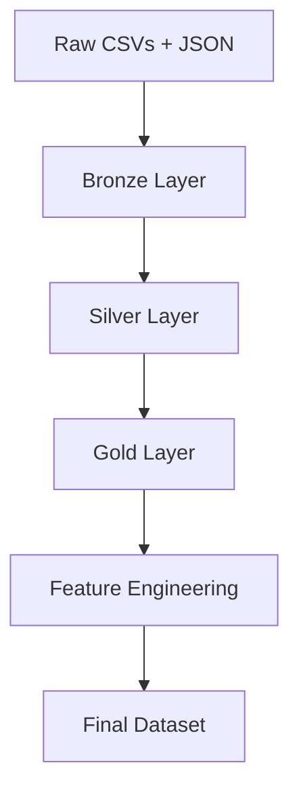

# README for Youtube Dataset ETL Project
## Project Overview

This project implements an end-to-end ETL pipeline in Databricks using PySpark and a multi-region YouTube Trending Videos [dataset](https://www.kaggle.com/datasets/datasnaek/youtube-new) sourced from Kaggle.

The pipeline ingests raw CSV and JSON files from multiple geographic regions, validates and transforms the data through Bronze, Silver, and Gold layers, and produces an analytics-ready dataset enriched with business-focused metrics such as engagement rate, comment rate, like ratio, and log-transformed views.

To improve maintainability and reusability, the project separates exploratory development, reusable ETL functions, pipeline orchestration, and downstream analytics into dedicated notebooks. The final Gold dataset is designed to support reporting, visualization, and further analytical workflows.

### Key Objectives:
- Build a reusable PySpark ETL pipeline using Databricks
- Implement Bronze, Silver, and Gold data layers
- Create automated validation and transformation functions
- Engineer business-focused engagement metrics
- Produce an analytics-ready dataset for downstream visualization

## Dataset

This project uses the YouTube Trending Videos Dataset, a collection of daily records of trending YouTube videos gathered through the YouTube API published on Kaggle.

The dataset contains trending videos information from multiple geographic regions, including Canada (CA), United States (US), Great Britain (GB), Germany (DE), France (FR), India (IN), Japan (JP), South Korea (KR), Mexico (MX), and Russsia (RU). Each region is provided as a separate dataset, making it well-suited for demonstrating multi-source ingestion and consolidation workflows.

### Data Summary

#### Raw Dataset (Ingestion Layer)

| Metric | Value |
|--------|-------|
| Total Size | 539.22 MB |
| Format | Multi-region CSV + JSON |
| Regions | 10 |

#### Gold Layer Dataset (Analytics-Ready)

| Metric | Value |
|--------|-------|
| Records | 207,142 |
| Columns | 19 |
| Estimated Size | 116.83 MB |

### Data Files

The dataset consists of two primary file types:

#### Video Data (CSV)

Regional CSV files containing video-level metrics and metadata, incudling:

- Video ID
- Video title
- Channel title
- Publish timestamp
- Trending date
- View count
- Like count
- Dislike count
- Comment count
- Status flags and additional metadata

#### Examples:

- CAvideos.csv
- USvideos.csv
- GBvideos.csv

### Category Metadata (JSON)

Regional JSON files containing mappings between YouTube category IDs and category names.

#### Examples:

- CA_category_id.json
- US_category_id.json
- GB_category_id.json

These files were used to enrich the video data through dimension-style joins, replacing category IDs with human-readable category names.

### ETL Considerations

This dataset presented several challenges commonly encountered in real-world data engineering workflows:

- Multi-line CSV records requiring specialized ingestion settings.
- Nested JSON structures requiring flattening and transformation.
- Multiple source files requiring schema validation before union operations.
- Mixed data types requiring explicit casting and cleaning.
- Regional category metadata requiring enrichment joins.
- Source lineage preservation through region tracking.

The final ETL pipeline consolidates all regional datasets into a unified analytics-ready Gold dataset suitable for reporting, visualization, and further analysis.

## Architecture

## ETL Pipeline

## Data Model

## Feature Engineering

## Analysis & Visualizations

## Techonology Used

## Future Improvements

## Usage

## References
